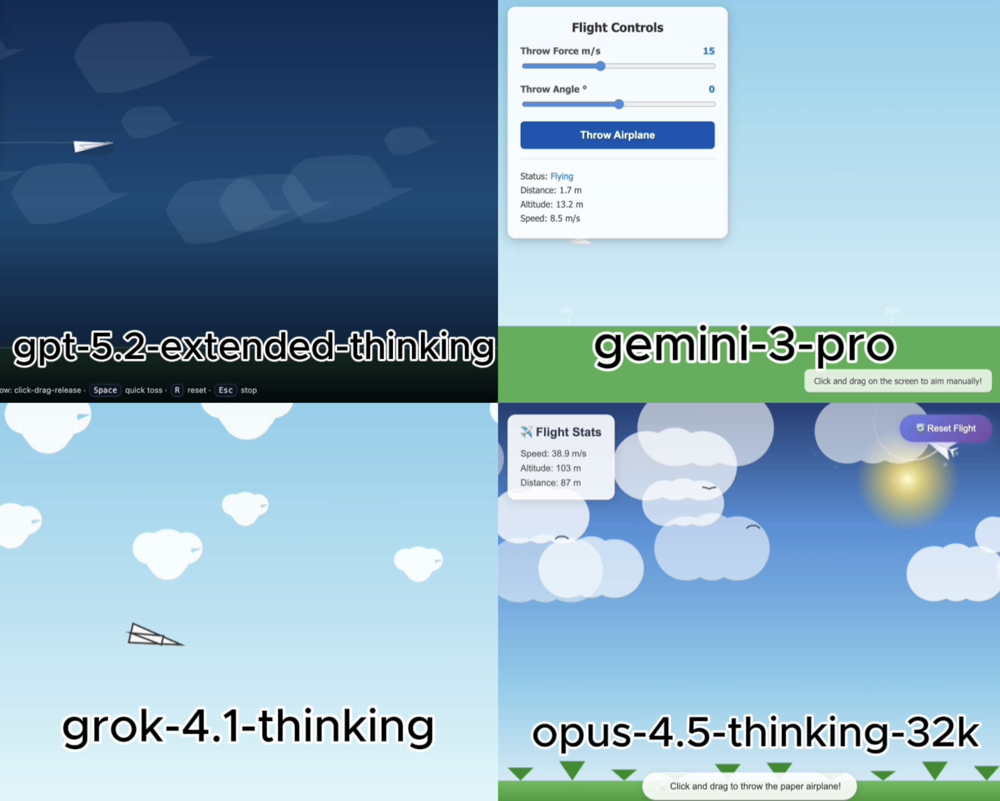

# HTML AI Battle

HTML AI Battle is a long-running experiment where multiple AI models get the exact same prompt and one shot to build a complete single-file web app.

The idea is simple: ask different models to make something like a game, animation, or simulation in one `.html` file, keep the first answer, and save the raw results. No repair prompts. No manual cleanup. No hidden post-editing of the code before judging it.

This repository is the public archive of that process. It includes the raw experiment folders, the workflow scripts used to collect and score the runs, and the paper materials built from the results.

## Start Here

| If you want to... | Go here |
| --- | --- |
| Browse the actual model outputs | [`experiments/`](./experiments/) |
| Open one example experiment first | [`experiments/paper_airplane_0204/`](./experiments/paper_airplane_0204/) |
| Read the paper | [arXiv:2605.06707](https://arxiv.org/pdf/2605.06707) |
| Open the analysis notebook | [`paper/research.ipynb`](./paper/research.ipynb) |
| View the project slide show | [`presentation.pdf`](./presentation.pdf) |
| Download the dataset as CSV | [`paper/experiment_tracker.csv`](./paper/experiment_tracker.csv) |
| Inspect the tracking spreadsheet | [`paper/experiment_tracker.xlsx`](./paper/experiment_tracker.xlsx) |
| See the original collection/scoring workflow | [`data_collection_program/`](./data_collection_program/) |

## What This Repo Is

This is not a polished benchmark package or a clean Python library.

It is a working archive of a real experiment series:

- the prompts that were used
- the raw HTML files returned by each model
- the screenshots and per-experiment notes
- the scoring and tracking data
- the paper and analysis notebook built on top of that archive

That makes the repository a little rough around the edges, but it also makes it transparent. You can inspect the exact outputs instead of only reading a summary.

## How A Battle Works

1. Write one prompt for a browser-based app, game, animation, or simulation.
2. Give that same prompt to each model.
3. Accept the first output only.
4. Save the raw `.html` files exactly as returned.
5. Review how well each result followed the prompt, whether it actually worked, and how good the interface looked.
6. Store the notes, scores, screenshots, and tracking data in the matching experiment folder.

The main recurring model families in the repo are GPT, Gemini, Grok, and Opus. Some folders also include extra comparison runs from other models.

## Repository Map

### [`experiments/`](./experiments/)

This is the main archive.

Each experiment folder usually contains:

- a `README.md` with the original prompt, summary table, rules, and observations
- one raw `.html` file per model
- an `image.png` preview
- tracking files such as `model_scores.json` or a per-experiment `.csv`

Good folders to start with:

- [`experiments/paper_airplane_0204/`](./experiments/paper_airplane_0204/)
- [`experiments/snake_0121/`](./experiments/snake_0121/)
- [`experiments/super_mario_1224/`](./experiments/super_mario_1224/)
- [`experiments/physics_simulation/`](./experiments/physics_simulation/)

### [`paper/`](./paper/)

This folder contains the public analysis materials that support the project:

- [`paper/research.ipynb`](./paper/research.ipynb): analysis notebook
- [`paper/experiment_tracker.csv`](./paper/experiment_tracker.csv): public CSV export
- [`paper/experiment_tracker.xlsx`](./paper/experiment_tracker.xlsx): tracking spreadsheet
- [`paper/figures/`](./paper/figures/) and [`paper/tables/`](./paper/tables/): exported visuals
- [`presentation.pdf`](./presentation.pdf): slide show version of the project presentation

Important scope note: the current analysis focuses on 17 experiments collected from December 10, 2025 to February 4, 2026, while the repository itself is the broader working archive and currently contains more than that subset. In other words, the repo and the formal write-up are related, but they are not exactly the same thing.

### [`data_collection_program/`](./data_collection_program/)

This is the original workflow tooling used during collection and evaluation.

It includes scripts for tasks like:

- creating the next experiment folder
- cleaning and resetting files between runs
- timing and logging model outputs
- counting reasoning words and HTML lines
- recording scores and observations
- preparing metadata used later in the paper workflow

If you want to understand that workflow, start with [`data_collection_program/README.md`](./data_collection_program/README.md).

## If You Just Want The Quick Version

This project asks a practical question:

What happens when you open public AI chat products, give them the same creative coding prompt, and judge only the first result they return?

If that question interests you, go to [`experiments/`](./experiments/). If you want the formal write-up, go to [`paper/`](./paper/).
