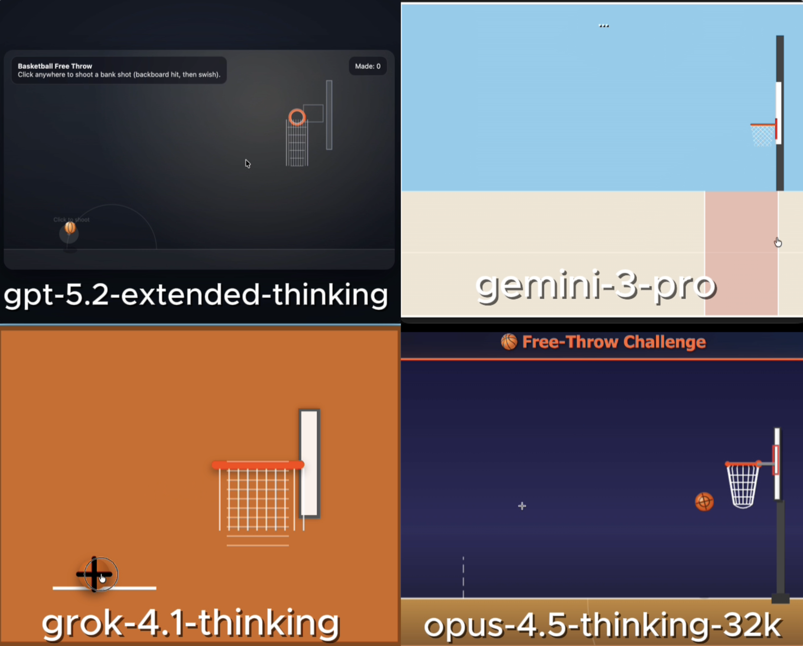

# 🧪 HTML AI Battle, HTML Animation Experiment

**TLDR:**  
4 Models try to: Create a basketball shot using HTML/CSS/JS html

---

## 🎯 Original Prompt

Create a simulation of a basketball free-throw shot using HTML/CSS/JS in a single HTML file. When the user clicks, the ball should launch with a realistic parabolic arc, hit the backboard, and swish through the net.

---

## 📸 Results Preview

---

## 🤖 Per-Model Output Summary

| LLM Model                 | Visual type | LLM Reasoning Time (s) | LLM Response Time (s) | Reasoning Total words | Reasoning Total characters | Reasoning Total sentences | Reasoning top keyword | Reasoning top keyword repetitions | Input Word Count | Lines of HTML | Platform | Code in Reasoning? | prompt_adherence_score (0-10) | functional_correctness_score (0-10) | ui_score (0-10) | Performance Score (0-10) | Song style   |
|:------------------------|:----------|---------------------:|--------------------:|:--------------------|:-------------------------|------------------------:|:--------------------|--------------------------------:|---------------:|------------:|:-------|:-----------------|----------------------------:|----------------------------------:|--------------:|-----------------------:|:-----------|
| gpt-5.2-extended-thinking | simple      |                    250 |                   366 | 2,346                 | 18,679                     |                        70 | rim                   |                                27 |               36 |           537 | Web UI   | y                  |                             5 |                                   5 |               5 |                        5 | hip hop, pop |
| gemini-3-pro              | simple      |                     24 |                    56 | 574                   | 3,566                      |                        32 | i'm                   |                                18 |               36 |           367 | Web UI   | n                  |                           7.5 |                                   7 |             8.5 |                      7.6 | hip hop, pop |
| grok-4.1-thinking         | simple      |                    232 |                   252 | 553                   | 3,544                      |                        43 | ball                  |                                22 |               36 |           215 | Web UI   | n                  |                             7 |                                   6 |               7 |                      6.7 | hip hop, pop |
| opus-4.5-thinking-32k     | simple      |                     71 |                   167 | 1,655                 | 12,779                     |                        44 | ball                  |                                25 |               36 |           862 | LMArena  | y                  |                           9.5 |                                 9.5 |               9 |                      9.4 | hip hop, pop |

---

## Weighted Performance Score
A single score that combines how well the model follows the prompt, how correctly the code works, and how good the UI looks.  
**performance_score = 0.40(prompt_adherence_score) + 0.35(functional_correctness_score) + 0.25(ui_score)**

---

## ✅ Experiment Rules
	•	✅ Same exact prompt for all models
	•	✅ First output only (no retries, no iterations)
	•	✅ Raw HTML outputs preserved exactly
	•	✅ No human edits

---

## 🧠 Observations

• gpt-5.2-extended-thinking: Failed to launch the ball in a proper parabolic shot on click, resulting only in a small, ineffective movement instead of a working free-throw simulation.  
• gemini-3-pro: Implemented a clickable shot but never aligned the trajectory with the hoop, so the ball can’t score regardless of where the user clicks.  
• grok-4.1-thinking: Produced a consistently misaligned trajectory that causes the ball to systematically miss or “avoid” the hoop, preventing any successful shots.  
• opus-4.5-thinking-32k: Delivered a fully functional and engaging free-throw mechanic with user-controlled power and direction, reliably swishing the ball through the net.

---

🔗 Original Post

X (Twitter) post showcasing the experiment:

Link: 

---
