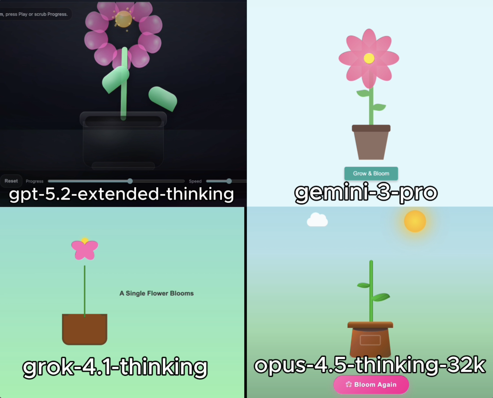

# 🧪 HTML AI Battle, HTML Animation Experiment

**TLDR:**  
4 Models try to: Create flower blooming in a pot simulation

---

## 🎯 Original Prompt

Create an animation of a single flower blooming in a pot. Using HTML/CSS/JS in a single HTML file.

---

## 📸 Results Preview

---

## 🤖 Per-Model Output Summary

| LLM Model                 |   LLM Reasoning Time (s) |   LLM Response Time (s) | Reasoning Total words   | Reasoning Total characters   |   Reasoning Total sentences | Reasoning top keyword   |   Reasoning top keyword repetitions |   Input Word Count |   Lines of HTML | Code in Reasoning?   |   prompt_adherence_score (0-10) |   functional_correctness_score (0-10) |   ui_score (0-10) |   Performance Score (0-10) |
|:--------------------------|-------------------------:|------------------------:|:------------------------|:-----------------------------|----------------------------:|:------------------------|------------------------------------:|-------------------:|----------------:|:---------------------|--------------------------------:|--------------------------------------:|------------------:|---------------------------:|
| gpt-5.2-extended-thinking |                       16 |                      76 | 71                      | 440                          |                           5 | Css                     |                                   3 |                 18 |             554 | n                    |                               9 |                                   9   |               7   |                        8.5 |
| gemini-3-pro              |                       10 |                      31 | 186                     | 1,130                        |                          14 | I'm                     |                                   5 |                 18 |             261 | n                    |                              10 |                                   9.5 |               9.5 |                        9.7 |
| grok-4.1-thinking         |                        3 |                       7 | 30                      | 171                          |                           1 | Request                 |                                   2 |                 18 |             192 | n                    |                               8 |                                   9   |               6.5 |                        8   |
| opus-4.5-thinking-32k     |                       74 |                     134 | 1,216                   | 9,122                        |                          24 | Animation               |                                  24 |                 18 |             459 | y                    |                              10 |                                  10   |               9.7 |                        9.9 |

## Weighted Performance Score
A single score that combines how well the model follows the prompt, how correctly the code works, and how good the UI looks.  
**performance_score = 0.40(prompt_adherence_score) + 0.35(functional_correctness_score) + 0.25(ui_score)**

---

## ✅ Experiment Rules
	•	✅ Same exact prompt for all models
	•	✅ First output only (no retries, no iterations)
	•	✅ Raw HTML outputs preserved exactly
	•	✅ No human edits

---

## 🧠 Observations
• gpt-5.2-extended-thinking: Failed to produce a functional simulation. The output focused primarily on textual or parameter-based elements rather than motion or physical behavior. No meaningful drifting or animation was observed. Overall prompt adherence was low, resulting in a minimal and ineffective implementation.

• gemini-3-pro: Successfully rendered a drifting scenario with a clear Drift style motion. While the overall execution was strong, the front tire behavior appeared visually inconsistent, slightly detracting from realism. Despite this, the motion and scene composition remained coherent and engaging.

• grok-4.1-thinking: Rendered a visible scene, but physics execution was incorrect. The vehicle appeared to float vertically, and the intended drifting behavior was replaced by camera movement rather than object motion. Functional rendering was achieved, but physical realism and prompt adherence were weak.

• opus-4.5-thinking-32k: Outstanding execution across motion, interactivity, and physics. The drifting behavior was correctly implemented, interactive elements were present, and the simulation demonstrated high fidelity and realism. This model delivered the most complete and polished result, significantly outperforming the others.

---

🔗 Original Post

X (Twitter) post showcasing the experiment:

Link: 

---
