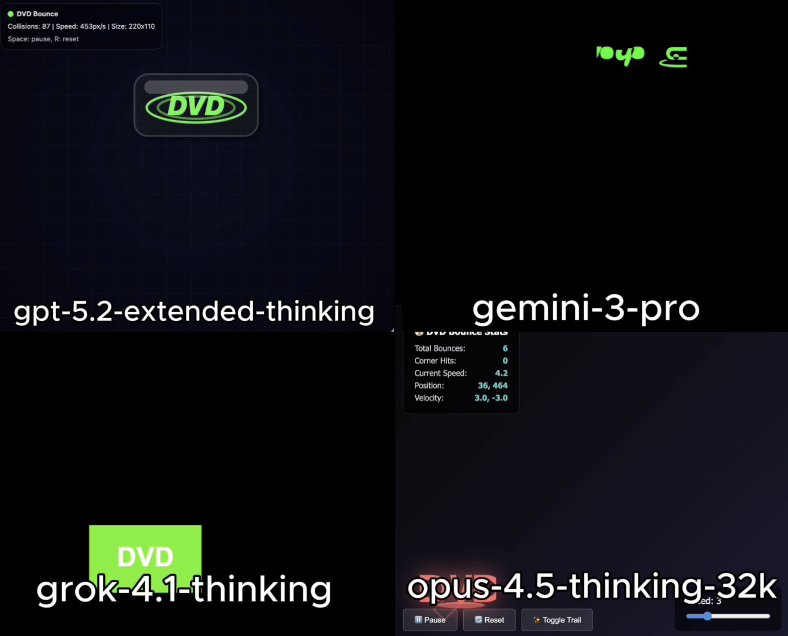

# 🧪 HTML AI Battle, HTML Animation Experiment

**TLDR:**  
4 Models try to: DVD logo bouncing simulation HTML

---

## 🎯 Original Prompt

Create a physics-accurate “Bouncing DVD Logo” simulation using HTML/CSS/JS in a single HTML file. The logo must bounce perfectly off all edges and corners, change color on every collision, and adapt correctly to dynamic window resizing.

---

## 📸 Results Preview

---

## 🤖 Per-Model Output Summary

| LLM Model                 |   LLM Reasoning Time (s) |   LLM Response Time (s) |   Reasoning Total words | Reasoning Total characters   |   Reasoning Total sentences | Reasoning top keyword   |   Reasoning top keyword repetitions |   Input Word Count |   Lines of HTML | Code in Reasoning?   |   prompt_adherence_score (0-10) |   functional_correctness_score (0-10) |   ui_score (0-10) |   Performance Score (0-10) |
|:--------------------------|-------------------------:|------------------------:|------------------------:|:-----------------------------|----------------------------:|:------------------------|------------------------------------:|-------------------:|----------------:|:---------------------|--------------------------------:|--------------------------------------:|------------------:|---------------------------:|
| gpt-5.2-extended-thinking |                       63 |                     112 |                     534 | 3,385                        |                          28 | Logo                    |                                  13 |                 36 |             366 | n                    |                              10 |                                  10   |              10   |                       10   |
| gemini-3-pro              |                       12 |                      36 |                     158 | 1,001                        |                          11 | I'm                     |                                   5 |                 36 |             146 | n                    |                               7 |                                   8.5 |               6   |                        7.3 |
| grok-4.1-thinking         |                       12 |                      16 |                      84 | 583                          |                           6 | Canvas                  |                                   3 |                 36 |             108 | n                    |                              10 |                                  10   |               8   |                        9.5 |
| opus-4.5-thinking-32k     |                       22 |                      91 |                     509 | 3,947                        |                           8 | Logo                    |                                  10 |                 36 |             479 | y                    |                              10 |                                  10   |               9.5 |                        9.9 |

## Weighted Performance Score
A single score that combines how well the model follows the prompt, how correctly the code works, and how good the UI looks.  
**performance_score = 0.40(prompt_adherence_score) + 0.35(functional_correctness_score) + 0.25(ui_score)**

---

## ✅ Experiment Rules
	•	✅ Same exact prompt for all models
	•	✅ First output only (no retries, no iterations)
	•	✅ Raw HTML outputs preserved exactly
	•	✅ No human edits

---

## 🧠 Observations
• gpt-5.2-extended-thinking: Delivered a strong and functional DVD logo simulation. Motion and edge collisions behaved correctly, and the oval styling around the DVD letters was well executed, adding visual polish. Overall prompt adherence and implementation quality were high.

• gemini-3-pro: Rendered a moving element with color changes, but failed to correctly display the DVD logo itself. While color transitions were present, the absence of the core logo resulted in incomplete prompt fulfillment and a disappointing outcome.

• grok-4.1-thinking: Executed exactly what was requested with no unnecessary additions. The implementation was clean, direct, and functional, prioritizing correctness over embellishment. Strong prompt adherence with a minimalist approach.

• opus-4.5-thinking-32k: Successfully implemented the requested behavior and added a trailing visual effect that followed the logo. Although this tail is not characteristic of a traditional DVD bounce logo, the overall execution was solid, creative, and met the core requirements effectively.

---

🔗 Original Post

X (Twitter) post showcasing the experiment:

Link: https://x.com/diegocabezas01/status/2002364713133387793?s=20

---
