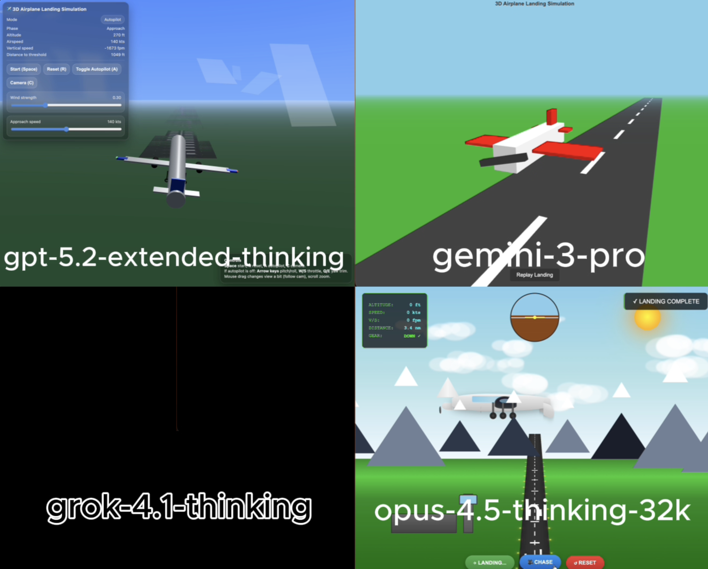

# 🧪 HTML AI Battle, HTML Animation Experiment

**TLDR:**  
4 Models try to: 3D airplane landing simulation using html

**Live viewer:** [Open all rendered outputs](https://gptaiacademy.com/ai-battles/html-viewer/experiments/airplane_0117)

---

## 🎯 Original Prompt

Create a 3D simulation of an airplane landing using HTML/CSS/JS.

---

## 📸 Results Preview

---

## 🤖 Per-Model Output Summary

| LLM Model                 | Visual type | LLM Reasoning Time (s) | LLM Response Time (s) | Reasoning Total words | Reasoning Total characters | Reasoning Total sentences | Reasoning top keyword | Reasoning top keyword repetitions | Input Word Count | Lines of HTML | Platform | Code in Reasoning? | prompt_adherence_score (0-10) | functional_correctness_score (0-10) | ui_score (0-10) | Performance Score (0-10) | Song style   |
|:------------------------|----------:|---------------------:|--------------------:|--------------------:|:-------------------------|------------------------:|:--------------------|--------------------------------:|---------------:|------------:|:-------|:-----------------|----------------------------:|----------------------------------:|--------------:|-----------------------:|:-----------|
| gpt-5.2-extended-thinking |             |                     49 |                   306 |                   368 | 2,321                      |                        20 | simulation            |                                 8 |               10 |           838 | Web UI   | n                  |                           9.5 |                                   9 |             9.5 |                      9.3 | hip hop, pop |
| gemini-3-pro              |             |                      6 |                    34 |                   105 | 719                        |                         8 | threejs               |                                 3 |               10 |           208 | Web UI   | n                  |                             9 |                                 8.5 |               8 |                      8.6 | hip hop, pop |
| grok-4.1-thinking         |             |                     95 |                   111 |                   255 | 1,663                      |                        22 | airplane              |                                10 |               10 |           190 | Web UI   | n                  |                             0 |                                   0 |               0 |                        0 | hip hop, pop |
| opus-4.5-thinking-32k     |             |                      8 |                   163 |                   173 | 1,079                      |                         3 | landing               |                                 5 |               10 |          1254 | LMArena  | n                  |                             4 |                                   4 |               4 |                        4 | hip hop, pop |

---

## Weighted Performance Score
A single score that combines how well the model follows the prompt, how correctly the code works, and how good the UI looks.  
**performance_score = 0.40(prompt_adherence_score) + 0.35(functional_correctness_score) + 0.25(ui_score)**

---

## ✅ Experiment Rules
	•	✅ Same exact prompt for all models
	•	✅ First output only (no retries, no iterations)
	•	✅ Raw HTML outputs preserved exactly
	•	✅ No human edits

---

## 🧠 Observations

• gpt-5.2-extended-thinking: Delivered a detailed 3D landing simulation with camera controls and rich visual touches, reflecting noticeable progress in capability and polish.
• gemini-3-pro: Produced a very simple yet functional implementation that fulfills the core landing requirement, despite the airplane’s somewhat comical, chicken-like appearance.
• grok-4.1-thinking: Returned code that fails to render, resulting in no working simulation.
• opus-4.5-thinking-32k: Emphasized visual extras over core behavior, resulting in a scene where the airplane floats instead of performing the intended landing.

---

🔗 Original Post

X (Twitter) post showcasing the experiment:

Link: https://x.com/diegocabezas01/status/2012528314326425871?s=20

---
