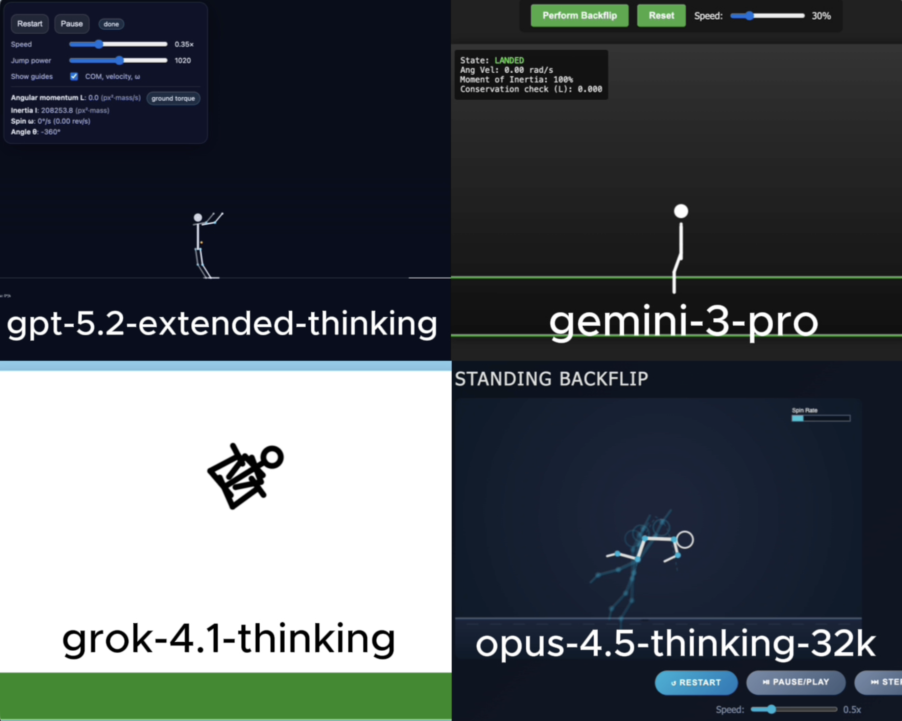

# 🧪 HTML AI Battle, HTML Animation Experiment

**TLDR:**  
4 Models try to: Slow-motion articulated stick-figure backflip animation html

**Live viewer:** [Open all rendered outputs](https://gptaiacademy.com/ai-battles/html-viewer/experiments/backflip_1014)

---

## 🎯 Original Prompt

Create a slow-motion simulation of a stick-figure human performing a standing backflip using HTML/CSS/JS. The figure needs articulated joints (knees, hips, elbows). It should crouch, jump, tuck tight to spin faster (conservation of angular momentum), and then extend legs to stick the landing.

---

## 📸 Results Preview

---

## 🤖 Per-Model Output Summary

| LLM Model                 | Visual type | LLM Reasoning Time (s) | LLM Response Time (s) | Reasoning Total words | Reasoning Total characters | Reasoning Total sentences | Reasoning top keyword | Reasoning top keyword repetitions | Input Word Count | Lines of HTML | Platform | Code in Reasoning? | prompt_adherence_score (0-10) | functional_correctness_score (0-10) | ui_score (0-10) | Performance Score (0-10) | Song style                                                                                                                                                                                                                                                                                                                                                                                                                                       |
|:------------------------|----------:|---------------------:|--------------------:|:--------------------|:-------------------------|------------------------:|:--------------------|--------------------------------:|---------------:|------------:|:-------|:-----------------|----------------------------:|----------------------------------:|--------------:|-----------------------:|:-----------------------------------------------------------------------------------------------------------------------------------------------------------------------------------------------------------------------------------------------------------------------------------------------------------------------------------------------------------------------------------------------------------------------------------------------|
| gpt-5.2-extended-thinking |             |                    466 |                   808 | 887                   | 5,565                      |                        47 | i’ll                  |                                20 |               43 |           827 | Web UI   | n                  |                             8 |                                   7 |               7 |                      7.4 | Trap, Southern hip-hop, Atlanta rap, Melodic rap, Gangsta rap, Modern hip-hop, Street rap, Drill-influenced rap, Bass-heavy rap, Minimalist trap                                                                                                                                                                                                                                                                                                 |
| gemini-3-pro              |             |                     19 |                    57 | 322                   | 2,107                      |                        21 | i'm                   |                                12 |               43 |           414 | Web UI   | n                  |                           7.5 |                                   7 |               7 |                      7.2 | Trap, Southern hip-hop, Atlanta rap, Melodic rap, Gangsta rap, Modern hip-hop, Street rap, Drill-influenced rap, Bass-heavy rap, Minimalist trap                                                                                                                                                                                                                                                                                                 |
| grok-4.1-thinking         |             |                    206 |                   223 | 498                   | 3,290                      |                        46 | tuck                  |                                17 |               43 |           179 | Web UI   | n                  |                             3 |                                   4 |               5 |                      3.9 | Trap, Southern hip-hop, Atlanta rap, Melodic rap, Gangsta rap, Modern hip-hop, Street rap, Drill-influenced rap, Bass-heavy rap, Minimalist trap                                                                                                                                                                                                                                                                                                 |
| opus-4.5-thinking-32k     |             |                    162 |                   265 | 2,630                 | 17,085                     |                        73 | torso                 |                                36 |               43 |           587 | LMArena  | y                  |                             8 |                                   8 |             8.5 |                      8.1 | Trap, Southern hip-hop, Atlanta rap, Melodic rap, Gangsta rap, Modern hip-hop, Street rap, Drill-influenced rap, Bass-heavy rap, Minimalist trap                                                                                                                                                                                                                                                                                                 |
|                           |             |                        |                       |                       |                            |                           |                       |                                   |                  |               |          |                    |                               |                                     |                 |                        0 | Trap, Atlanta trap, melodic trap, Southern hip-hop, pop-rap, cloud rap, mumble rap, drill-inspired trap, luxury rap, piano-led trap, guitar trap, dark trap, minimalist 808s, bouncy 808s, halftime groove, club rap, radio-friendly rap, late-night vibe, vibey rap, hype rap, chill trap, bass-heavy, spacey synths, auto-tuned vocals, hook-driven, swagger rap, flex rap, street anthem, TikTok rap vibe, slowed + reverb, chopped + screwed |

---

## Weighted Performance Score
A single score that combines how well the model follows the prompt, how correctly the code works, and how good the UI looks.  
**performance_score = 0.40(prompt_adherence_score) + 0.35(functional_correctness_score) + 0.25(ui_score)**

---

## ✅ Experiment Rules
	•	✅ Same exact prompt for all models
	•	✅ First output only (no retries, no iterations)
	•	✅ Raw HTML outputs preserved exactly
	•	✅ No human edits

---

## 🧠 Observations

• gpt-5.2-extended-thinking: Animation direction is ambiguous between backflip and frontflip, the jump arc looks unnatural, but the figure manages to land correctly.
• gemini-3-pro: Flip direction is unclear and the figure performs multiple mid-air rotations, ultimately resulting in an incorrect landing.
• grok-4.1-thinking: The figure’s body shape devolves into a car-like form, floats with unnatural movements, and ends by landing in the same car-like pose.
• opus-4.5-thinking-32k: Clearly animates a frontflip rather than the requested backflip, but otherwise delivers convincing slow motion, believable physics, and a clean, accurate landing.

---

🔗 Original Post

X (Twitter) post showcasing the experiment:

Link: https://x.com/diegocabezas01/status/2011490487828693413?s=20

---
