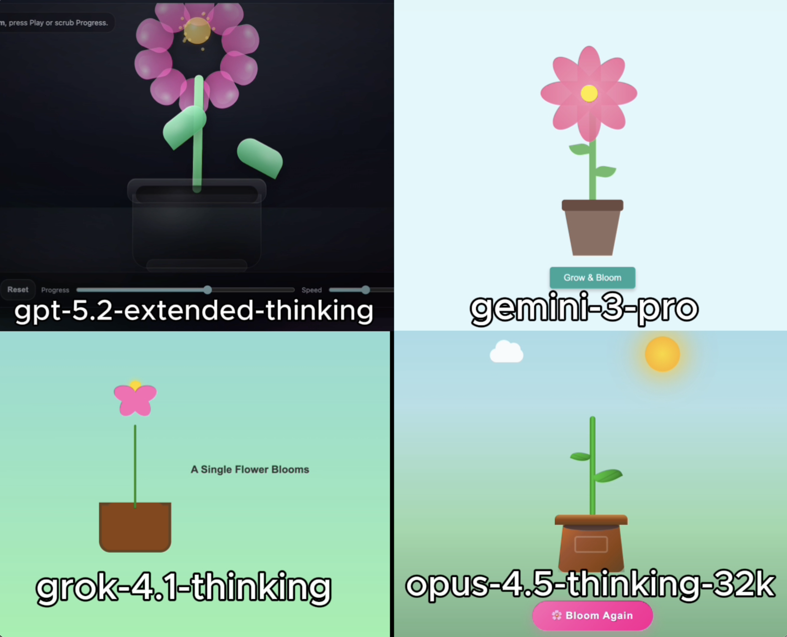

# 🧪 HTML AI Battle, HTML Animation Experiment

**TLDR:**  
4 Models try to: Create flower blooming in a pot simulation

---

## 🎯 Original Prompt

Create an animation of a single flower blooming in a pot. Using HTML/CSS/JS in a single HTML file.

---

## 📸 Results Preview

---

## 🤖 Per-Model Output Summary

| LLM Model                 |   LLM Reasoning Time (s) |   LLM Response Time (s) | Reasoning Total words   | Reasoning Total characters   |   Reasoning Total sentences | Reasoning top keyword   |   Reasoning top keyword repetitions |   Input Word Count |   Lines of HTML | Code in Reasoning?   |   prompt_adherence_score (0-10) |   functional_correctness_score (0-10) |   ui_score (0-10) |   Performance Score (0-10) |
|:--------------------------|-------------------------:|------------------------:|:------------------------|:-----------------------------|----------------------------:|:------------------------|------------------------------------:|-------------------:|----------------:|:---------------------|--------------------------------:|--------------------------------------:|------------------:|---------------------------:|
| gpt-5.2-extended-thinking |                       16 |                      76 | 71                      | 440                          |                           5 | Css                     |                                   3 |                 18 |             554 | n                    |                               9 |                                   9   |               7   |                        8.5 |
| gemini-3-pro              |                       10 |                      31 | 186                     | 1,130                        |                          14 | I'm                     |                                   5 |                 18 |             261 | n                    |                              10 |                                   9.5 |               9.5 |                        9.7 |
| grok-4.1-thinking         |                        3 |                       7 | 30                      | 171                          |                           1 | Request                 |                                   2 |                 18 |             192 | n                    |                               8 |                                   9   |               6.5 |                        8   |
| opus-4.5-thinking-32k     |                       74 |                     134 | 1,216                   | 9,122                        |                          24 | Animation               |                                  24 |                 18 |             459 | y                    |                              10 |                                  10   |               9.7 |                        9.9 |

## Weighted Performance Score
A single score that combines how well the model follows the prompt, how correctly the code works, and how good the UI looks.  
**performance_score = 0.40(prompt_adherence_score) + 0.35(functional_correctness_score) + 0.25(ui_score)**

---

## ✅ Experiment Rules
	•	✅ Same exact prompt for all models
	•	✅ First output only (no retries, no iterations)
	•	✅ Raw HTML outputs preserved exactly
	•	✅ No human edits

---

## 🧠 Observations
• gpt-5.2-extended-thinking: Produced a working blooming-flower animation, but the plant structure looked off for the prompt. The flower was present, yet the leaves appeared to detach or behave strangely, which hurt the overall visual coherence. The result was still functional and mostly followed the task, but it fell short of expectations for a polished single-prompt output.

• gemini-3-pro: Delivered a very strong flower-in-a-pot result with a clean blooming effect and attractive visual design. The scene followed the prompt closely, looked polished, and had one of the best overall presentations in the experiment.

• grok-4.1-thinking: Created a simple but functional blooming-flower animation. The flower shape read more like a butterfly than a flower, and the implementation lacked leaves, but it still captured the basic idea of the prompt and completed the core task.

• opus-4.5-thinking-32k: Delivered the strongest result of the experiment, with a highly polished blooming flower, rich presentation, and excellent prompt adherence. The output looked far more complete and refined than the others, making it the clear top performer in this run.

---

🔗 Original Post

X (Twitter) post showcasing the experiment:

Link: https://x.com/diegocabezas01/status/2001400005312287181?s=20

---
