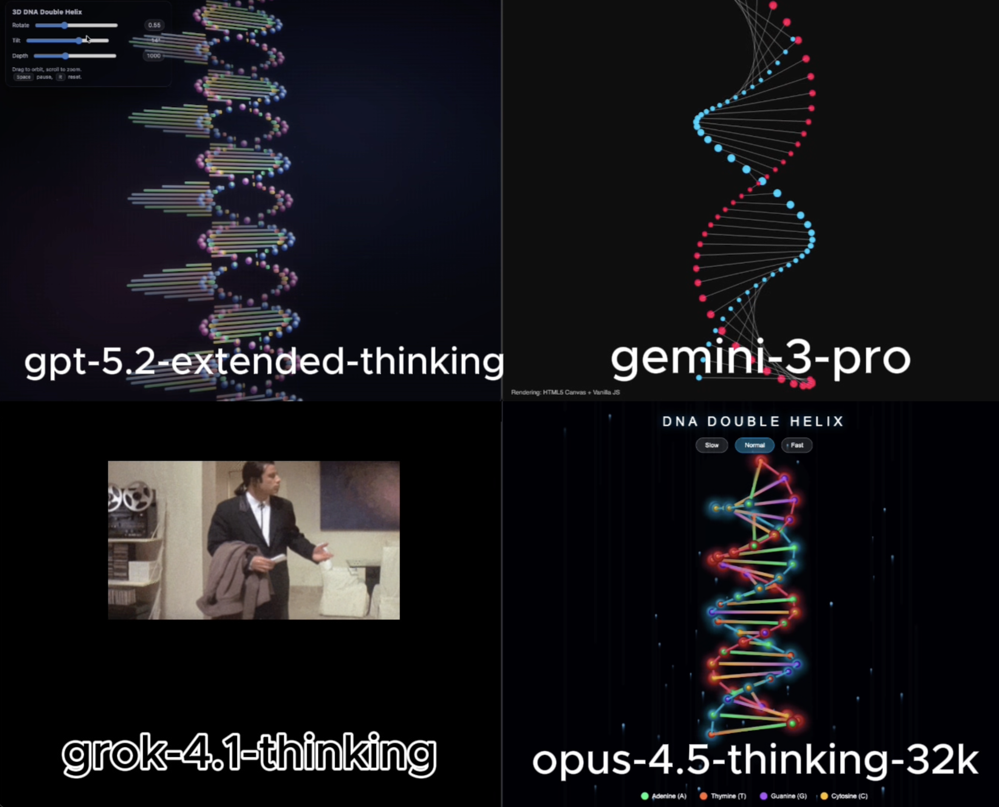

# 🧪 HTML AI Battle, HTML Animation Experiment

**TLDR:**  
4 Models try to: Rotating 3D double helix DNA animation html

**Live viewer:** [Open all rendered outputs](https://gptaiacademy.com/ai-battles/html-viewer/experiments/dna_0124)

---

## 🎯 Original Prompt

Create a rotating 3D animation of a Double Helix Human DNA strand using HTML/CSS/JS in a single HTML file.

---

## 📸 Results Preview

---

## 🤖 Per-Model Output Summary

| LLM Model                 | Visual type | LLM Reasoning Time (s) | LLM Response Time (s) | Reasoning Total words | Reasoning Total characters | Reasoning Total sentences | Reasoning top keyword | Reasoning top keyword repetitions | Input Word Count | Lines of HTML | Platform | Code in Reasoning? | prompt_adherence_score (0-10) | functional_correctness_score (0-10) | ui_score (0-10) | Performance Score (0-10) | Song style   |
|:------------------------|:----------|---------------------:|--------------------:|:--------------------|:-------------------------|------------------------:|:--------------------|--------------------------------:|---------------:|------------:|:-------|:-----------------|----------------------------:|----------------------------------:|--------------:|-----------------------:|:-----------|
| gpt-5.2-extended-thinking | simple      |                     17 |                   112 | 148                   | 927                        |                        11 | i'll                  |                                 4 |               19 |           549 | Web UI   | n                  |                             6 |                                   6 |               6 |                        6 | hip hop, pop |
| gemini-3-pro              | simple      |                     17 |                    38 | 334                   | 2,098                      |                        23 | i'm                   |                                 8 |               19 |           191 | Web UI   | n                  |                           9.5 |                                 9.5 |             9.5 |                      9.5 | hip hop, pop |
| grok-4.1-thinking         | simple      |                     88 |                    97 | 337                   | 2,147                      |                        24 | helix                 |                                 9 |               19 |           113 | Web UI   | n                  |                             0 |                                   0 |               0 |                        0 | hip hop, pop |
| opus-4.5-thinking-32k     | simple      |                     55 |                   107 | 1,415                 | 10,735                     |                        35 | const                 |                                19 |               19 |           471 | LMArena  | y                  |                           9.5 |                                 9.5 |             9.6 |                      9.5 | hip hop, pop |

---

## Weighted Performance Score
A single score that combines how well the model follows the prompt, how correctly the code works, and how good the UI looks.  
**performance_score = 0.40(prompt_adherence_score) + 0.35(functional_correctness_score) + 0.25(ui_score)**

---

## ✅ Experiment Rules
	•	✅ Same exact prompt for all models
	•	✅ First output only (no retries, no iterations)
	•	✅ Raw HTML outputs preserved exactly
	•	✅ No human edits

---

## 🧠 Observations

• gpt-5.2-extended-thinking: Produced a 2D rather than 3D helix and included non-functional sliders, falling short of the expected quality for the requested animation.  
• gemini-3-pro: Delivered a smooth, visually appealing helix animation that worked well and provided a clear, focused simulation.  
• grok-4.1-thinking: Returned non-working code that prevented evaluation of the animation, resulting in an unusable solution.  
• opus-4.5-thinking-32k: Implemented a detailed, colorful helix with a dynamic space-themed background and interactive controls for adjusting rotation speed.

---

🔗 Original Post

X (Twitter) post showcasing the experiment:

Link: https://x.com/diegocabezas01/status/2015064627642564747?s=20

---
