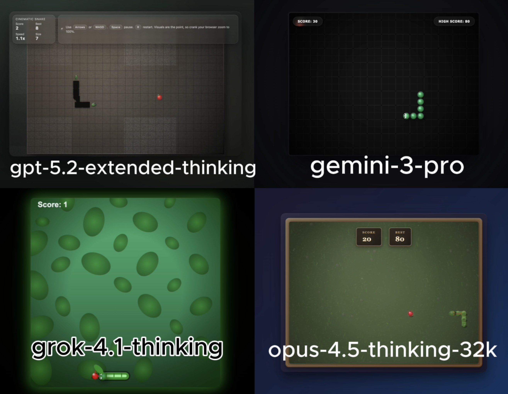

# 🧪 HTML AI Battle, HTML Animation Experiment

**TLDR:**  
4 Models try to: Realistic pseudo-3D Snake game with CGI-style html

**Live viewer:** [Open all rendered outputs](https://gptaiacademy.com/ai-battles/html-viewer/experiments/snake_0121)

---

## 🎯 Original Prompt

Create a classic "Snake" game using HTML, CSS, and JavaScript, all within a single HTML file. The player controls a snake that grows longer when it eats food. The game ends if the snake collides with the walls or its own tail. Prioritize a rich, visually detailed UI, avoid simplistic visuals. Instead, aim for a realistic, pseudo-3D aesthetic for the snake, food, and background, using advanced visual effects, shadows, gradients, and animations to simulate depth and texture. Dont do simple black backgrounds or neon stuff, I want this too look like a CGI movie, the snake should looks like a real 3d depth snake, the food should look realistic. IMPORTANT: dont do a simple visual game, the realistic visuals are the main focus.

---

## 📸 Results Preview

---

## 🤖 Per-Model Output Summary

| LLM Model                 | Visual type | LLM Reasoning Time (s) | LLM Response Time (s) | Reasoning Total words | Reasoning Total characters | Reasoning Total sentences | Reasoning top keyword | Reasoning top keyword repetitions | Input Word Count | Lines of HTML | Platform | Code in Reasoning? | prompt_adherence_score (0-10) | functional_correctness_score (0-10) | ui_score (0-10) | Performance Score (0-10) | Song style   |
|:------------------------|:----------|---------------------:|--------------------:|--------------------:|:-------------------------|------------------------:|:--------------------|--------------------------------:|---------------:|------------:|:-------|:-----------------|----------------------------:|----------------------------------:|--------------:|-----------------------:|:-----------|
| gpt-5.2-extended-thinking | simple      |                    274 |                   780 |                   851 | 5,588                      |                        51 | i'll                  |                                21 |              123 |          1422 | Web UI   | n                  |                           8.5 |                                 9.5 |               9 |                        9 | hip hop, pop |
| gemini-3-pro              | simple      |                     20 |                    69 |                   369 | 2,316                      |                        25 | i'm                   |                                10 |              123 |           506 | Web UI   | n                  |                             6 |                                 9.5 |               7 |                      7.5 | hip hop, pop |
| grok-4.1-thinking         | simple      |                    175 |                   203 |                   612 | 4,034                      |                        44 | snake                 |                                26 |              123 |           366 | Web UI   | n                  |                           8.6 |                                 9.5 |             9.1 |                        9 | hip hop, pop |
| opus-4.5-thinking-32k     | simple      |                     15 |                   201 |                   235 | 1,751                      |                         2 | realistic             |                                 8 |              123 |          1085 | LMArena  | y                  |                             9 |                                 9.5 |             9.5 |                      9.3 | hip hop, pop |

---

## Weighted Performance Score
A single score that combines how well the model follows the prompt, how correctly the code works, and how good the UI looks.  
**performance_score = 0.40(prompt_adherence_score) + 0.35(functional_correctness_score) + 0.25(ui_score)**

---

## ✅ Experiment Rules
	•	✅ Same exact prompt for all models
	•	✅ First output only (no retries, no iterations)
	•	✅ Raw HTML outputs preserved exactly
	•	✅ No human edits

---

## 🧠 Observations

• gpt-5.2-extended-thinking: Achieved a visually appealing result with a strong background and well-designed snake head, tail, and apple, though the snake’s body remained simple black squares that fell short of the requested fully realistic aesthetic.  
• gemini-3-pro: Produced a good-looking, fully playable game but failed the core brief by keeping a black background and not rendering a realistic snake, missing the main visual priorities despite solid functionality.  
• grok-4.1-thinking: Delivered a working game that aligned with the prompt’s requirements, featuring a visually enhanced snake and a suitable background that collectively matched the requested aesthetic direction.  
• opus-4.5-thinking-32k: Stood out with a more realistic snake—complete with tongue and eyes—and a well-crafted background, resulting in a polished, functional game that strongly satisfied the realism and visual depth goals.

---

🔗 Original Post

X (Twitter) post showcasing the experiment:

Link: https://x.com/diegocabezas01/status/2014112148998271209?s=20

---
