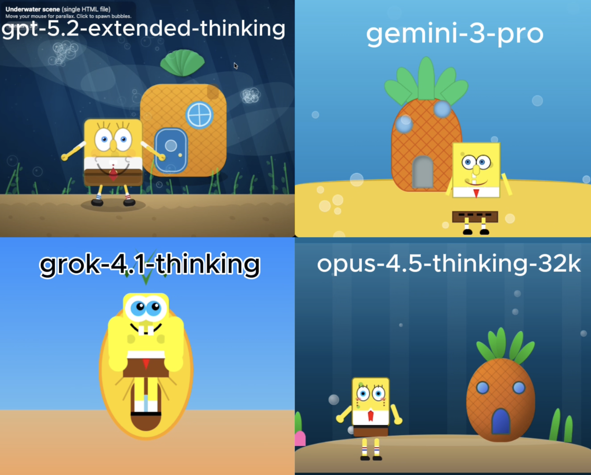

# 🧪 HTML AI Battle, HTML Animation Experiment

**TLDR:**  
4 Models try to: Underwater SpongeBob home animation using html

**Live viewer:** [Open all rendered outputs](https://gptaiacademy.com/ai-battles/html-viewer/experiments/spongebob_0128)

---

## 🎯 Original Prompt

Create an animation of SpongeBob and his home behind him, under the water using HTML/CSS/JS in a single HTML file.

---

## 📸 Results Preview

---

## 🤖 Per-Model Output Summary

| LLM Model                 | Visual type | LLM Reasoning Time (s) | LLM Response Time (s) | Reasoning Total words | Reasoning Total characters | Reasoning Total sentences | Reasoning top keyword | Reasoning top keyword repetitions | Input Word Count | Lines of HTML | Platform | Code in Reasoning? | prompt_adherence_score (0-10) | functional_correctness_score (0-10) | ui_score (0-10) | Performance Score (0-10) | Song style   |
|:------------------------|:----------|---------------------:|--------------------:|--------------------:|:-------------------------|------------------------:|:--------------------|--------------------------------:|---------------:|------------:|:-------|:-----------------|----------------------------:|----------------------------------:|--------------:|-----------------------:|:-----------|
| gpt-5.2-extended-thinking | simple      |                     19 |                   271 |                    74 | 520                        |                         6 | spongebob             |                                 3 |               20 |           837 | Web UI   | n                  |                           9.5 |                                   9 |             8.8 |                      9.2 | hip hop, pop |
| gemini-3-pro              | simple      |                     12 |                    51 |                   265 | 1,774                      |                        19 | i'm                   |                                11 |               20 |           474 | Web UI   | n                  |                           9.5 |                                 8.8 |               8 |                      8.9 | hip hop, pop |
| grok-4.1-thinking         | simple      |                     96 |                   113 |                   279 | 1,842                      |                        22 | pineapple             |                                 8 |               20 |           234 | Web UI   | n                  |                             7 |                                   6 |               5 |                      6.2 | hip hop, pop |
| opus-4.5-thinking-32k     | simple      |                      9 |                    76 |                   127 | 774                        |                         2 | blue                  |                                 3 |               20 |           702 | LMArena  | n                  |                           9.5 |                                 8.9 |               9 |                      9.2 | hip hop, pop |

---

## Weighted Performance Score
A single score that combines how well the model follows the prompt, how correctly the code works, and how good the UI looks.  
**performance_score = 0.40(prompt_adherence_score) + 0.35(functional_correctness_score) + 0.25(ui_score)**

---

## ✅ Experiment Rules
	•	✅ Same exact prompt for all models
	•	✅ First output only (no retries, no iterations)
	•	✅ Raw HTML outputs preserved exactly
	•	✅ No human edits

---

## 🧠 Observations

• gpt-5.2-extended-thinking: Produced a recognizable SpongeBob with engaging click-triggered bubble effects; main visual issues were the blinking eyes and the oddly square pineapple shape.  
• gemini-3-pro: Delivered a scene with a well-shaped pineapple but a heavily distorted SpongeBob, including a floating arm, missing waist, vertical teeth, and no visible hands.  
• grok-4.1-thinking: Generated an unsettling SpongeBob and an especially odd-looking pineapple, though the bubble effect was a nice interactive touch despite the overall need for refinement.  
• opus-4.5-thinking-32k: Created a decent pineapple house and solid bubble effects, but omitted key SpongeBob facial features like his nose and mouth, leaving the character incomplete.

---

🔗 Original Post

X (Twitter) post showcasing the experiment:

Link: https://x.com/diegocabezas01/status/2016642250093269251?s=20

---
