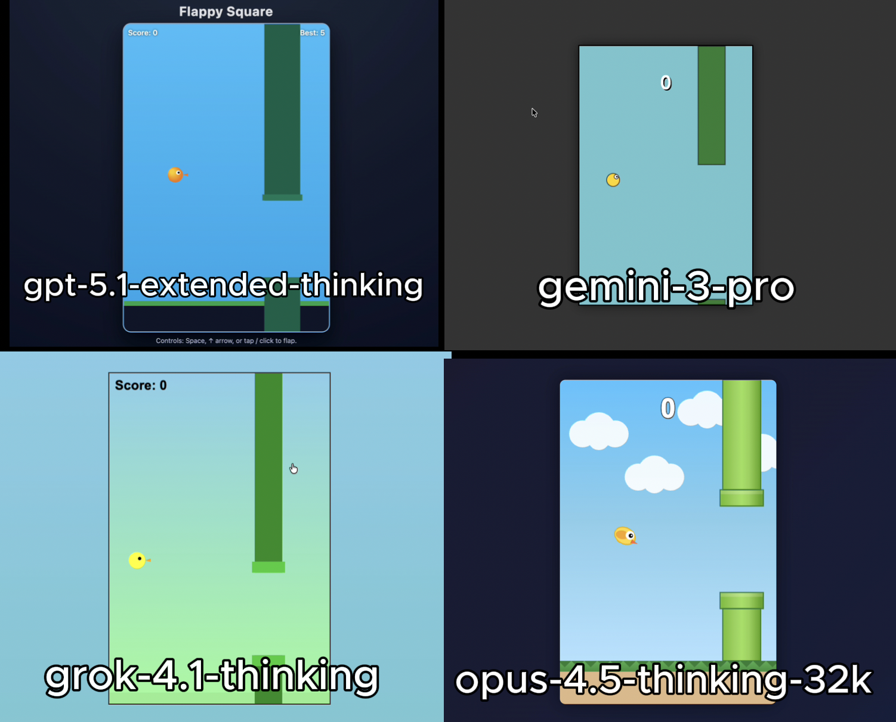

# 🧪 HTML AI Battle, HTML Animation Experiment

**TLDR:**  
4 Models try to: Recreate Flappy bird.

---

## 🎯 Original Prompt

Make a game like flappy bird using HTML/CSS/JS in a single HTML file

---

## 📸 Results Preview

---

## 🤖 Per-Model Output Summary

| # | LLM Model               | LLM Reasoning Time (s) | LLM Response Time (s) | Reasoning Total words | Reasoning Total characters | Reasoning Total sentences | Reasoning top keyword | Reasoning top keyword repetitions | Input Word Count | Lines of HTML | Performance Score (0-10) |
|---|-------------------------|-------------------------|-------------------------|------------------------|-----------------------------|----------------------------|-------------------------|------------------------------------|-------------------|----------------|---------------------------|
| 1 | gpt-5.1-extended-thinking | 44 | 106 | 326 | 2,010 | 23 | Game | 12 | 13 | 427 | 9.2 |
| 2 | gemini-3-pro            | 17 | 44  | 261 | 1,534 | 19 | I'm  | 9  | 13 | 324 | 8.7 |
| 3 | grok-4.1-thinking       | 11 | 19  | 114 | 704   | 6  | Game | 6  | 13 | 201 | 8.7 |
| 4 | opus-4.5-thinking-32k   | 61 | 124 | 1,363 | 12,726 | 23 | Pipes | 18 | 13 | 503 | 9.3 |
| 5 | —                       | —  | —   | —   | —     | —  | —    | —  | —  | —   | 0.0 |

---

## ✅ Experiment Rules
	•	✅ Same exact prompt for all models
	•	✅ First output only (no retries, no iterations)
	•	✅ Raw HTML outputs preserved exactly
	•	✅ No human edits

---

## 🧠 Observations
• gpt-5.1-extended-thinking: Followed the prompt cleanly with a solid UI. The bird includes a proper beak, and both a live score counter and high score counter are implemented. Overall, a very polished and functional result.

• gemini-3-pro: UI effort was noticeably lower. The bird lacks a beak, and there is no high score counter, but the core gameplay works as expected. Despite missing visual details, the execution is still solid.

• grok-4.1-thinking: Limited UI polish, but the bird correctly includes a beak. The game functions properly, though it lacks a high score metric. Functional but visually minimal.

• opus-4.5-thinking-32k: Exceptional attention to UI and bird detail. The bird includes internal animated sections that move with gravity, delivering the most visually impressive result. Best overall UI with a proper high score system implemented.

---

🔗 Original Post

X (Twitter) post showcasing the experiment:

Link: https://x.com/diegocabezas01/status/1998925426085998887?s=20

---

## 📊 Future Work
    •	Scoring framework