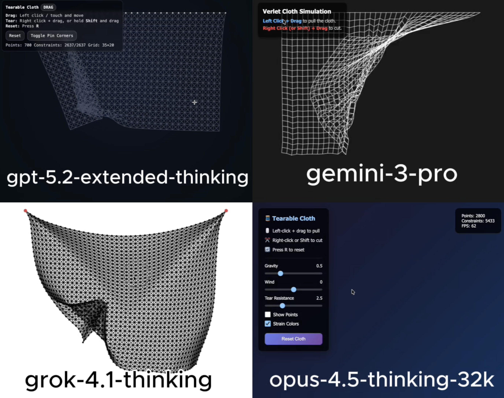

# 🧪 HTML AI Battle, HTML Animation Experiment

**TLDR:**  
4 Models try to: Interactive tearable cloth physics simulation html

---

## 🎯 Original Prompt

Create an interactive 'Tearable Cloth' simulation using HTML/CSS/JS in a single file. Render a grid of points connected by constraints (springs) that react to gravity. Allow the user to drag the cloth with their mouse and right-click (or hold Shift) to slice/cut the connections.

---

## 📸 Results Preview

---

## 🤖 Per-Model Output Summary

| LLM Model                 | LLM Reasoning Time (s) | LLM Response Time (s) | Reasoning Total words | Reasoning Total characters | Reasoning Total sentences | Reasoning top keyword | Reasoning top keyword repetitions | Input Word Count | Lines of HTML | Code in Reasoning? | prompt_adherence_score (0-10) | functional_correctness_score (0-10) | ui_score (0-10) | Performance Score (0-10) |
|:------------------------|---------------------:|--------------------:|:--------------------|:-------------------------|------------------------:|:--------------------|--------------------------------:|---------------:|------------:|:-----------------|----------------------------:|----------------------------------:|--------------:|-----------------------:|
| gpt-5.2-extended-thinking |                     18 |                   115 | 58                    | 414                        |                         4 | code                  |                                 3 |               44 |           502 | n                  |                           8.5 |                                 8.5 |               9 |                      8.6 |
| gemini-3-pro              |                     13 |                    40 | 185                   | 1,241                      |                        12 | i'm                   |                                 6 |               44 |           351 | n                  |                             9 |                                   8 |               8 |                      8.4 |
| grok-4.1-thinking         |                    104 |                   214 | 393                   | 2,633                      |                        33 | points                |                                 9 |               44 |           262 | n                  |                           9.5 |                                   9 |             7.5 |                      8.8 |
| opus-4.5-thinking-32k     |                     58 |                   151 | 1,488                 | 13,958                     |                        23 | const                 |                                38 |               44 |           795 | y                  |                           5.5 |                                 5.5 |               7 |                      5.9 |

---

## Weighted Performance Score
A single score that combines how well the model follows the prompt, how correctly the code works, and how good the UI looks.  
**performance_score = 0.40(prompt_adherence_score) + 0.35(functional_correctness_score) + 0.25(ui_score)**

---

## ✅ Experiment Rules
	•	✅ Same exact prompt for all models
	•	✅ First output only (no retries, no iterations)
	•	✅ Raw HTML outputs preserved exactly
	•	✅ No human edits

---

## 🧠 Observations

• gpt-5.2-extended-thinking: Implemented convincing gravity and an excellent tear mechanic, plus a genuinely useful “toggle pin corners” option. However, the cloth behavior introduced an unrequested “stickiness,” where after dragging, the fabric remains stuck in place, creating friction against the intended free-moving simulation.

• gemini-3-pro: Delivered a strong, prompt-faithful cloth simulation with smooth gravity response and a satisfying, clean cutting interaction. The UI was very minimal, but it matched the request and kept the experience straightforward and reliable.

• grok-4.1-thinking: Surprised with a simple but highly effective implementation, featuring solid gravity, responsive dragging, and a tear feature that worked perfectly. It lacked any UI or user instructions compared to the others, but the core mechanics were implemented correctly and performed very well.

• opus-4.5-thinking-32k: Over-invested in UI elements while missing a core structural requirement, as the cloth was not properly anchored and repeatedly fell at startup. Dragging was nonfunctional, and tearing required manual adjustment of tear resistance, though the tear mechanic itself worked. Wind and gravity sliders were a welcome addition, but overall interactivity and baseline setup were significantly compromised.

---

🔗 Original Post

X (Twitter) post showcasing the experiment:

Link: 

---
