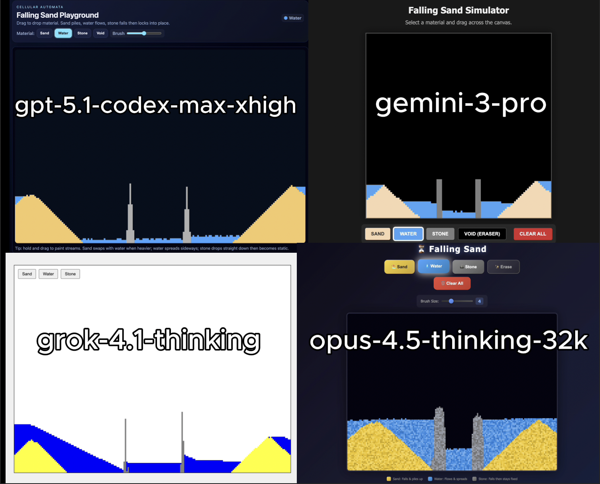

# 🧪 HTML AI Battle, HTML Animation Experiment

**TLDR:**  
4 Models try to: Generate a single file interactive falling sand simulation with gravity, sand, water, and stone using cellular automata physics.

---

## 🎯 Original Prompt

Create a single-file HTML/CSS/JS "Falling Sand" simulation. It must be interactive, the user should be able to click and drop the physical element, basic purpose here is gravity, elements and mass. Implement cellular automata physics where Sand (yellow) falls and piles up, Water (blue) falls and flows horizontally, and Stone (grey) behaves as rigid blocks that fall under gravity but, once they land, stay completely static without changing size, shape, or merging. Include a generic "Void" background, allow mouse dragging to paint particles, and add buttons to switch between materials.

---

## 📸 Results Preview

---

## 🤖 Per-Model Output Summary

| Model | Lines of HTML | Time to Generate | Score / 10 |
|--------|----------------|------------------|------------|
| opus-4.5-thinking-32k | 718 | ⏱️ ___ | 9.5 |
| gpt-5.1-codex-max-xhigh | 436 | ⏱️ ___ | 9 |
| gemini-3-pro | 295 | ⏱️ ___ | 9 |
| grok-4.1-thinking | 184 | ⏱️ ___ | 7 |

---

## ✅ Experiment Rules
	•	✅ Same exact prompt for all models
	•	✅ First output only (no retries, no iterations)
	•	✅ Raw HTML outputs preserved exactly
	•	✅ No human edits

---

## 🧠 Observations
	•	**opus-4.5-thinking-32k**: Best overall UI and visual polish. Most balanced physics and interactivity. Cleanest user experience of the four.
	•	**gpt-5.1-codex-max-xhigh**: Excellent UI layout, strong brush sizing, and very clean visuals. Felt professional and well-structured.
	•	**gemini-3-pro**: Great tool design with the addition of an eraser. Strong usability and solid visual execution overall.
	•	**grok-4.1-thinking**: White background reduced visual clarity, sand color looked off, and water physics felt less realistic. Still functional but weaker visually.

---

🔗 Original Post

X (Twitter) post showcasing the experiment:
Link: https://x.com/________

---

## 📊 Future Work
	•	Correlation matrix between:
	•	    Lines of code
	•	    Visual accuracy
	•	    Prompt adherence
	•	    Physics stability
	•	    Interactivity quality

    •	Scoring framework