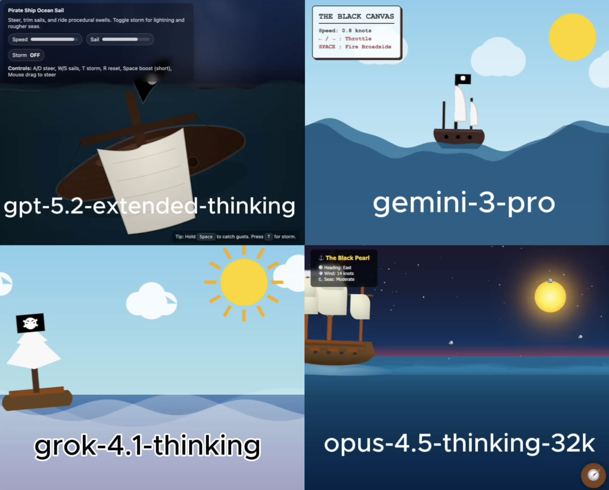

# 🧪 HTML AI Battle, HTML Animation Experiment

**TLDR:**  
4 Models try to: Pirate ship ocean voyage simulation html

---

## 🎯 Original Prompt

Create a simulation of a pirate ship sailing through open ocean. Using HTML/CSS/JS in a single HTML file.

---

## 📸 Results Preview

---

## 🤖 Per-Model Output Summary

| LLM Model                 | LLM Reasoning Time (s) | LLM Response Time (s) | Reasoning Total words | Reasoning Total characters | Reasoning Total sentences | Reasoning top keyword | Reasoning top keyword repetitions | Input Word Count | Lines of HTML | Code in Reasoning? | prompt_adherence_score (0-10) | functional_correctness_score (0-10) | ui_score (0-10) | Performance Score (0-10) |
|:------------------------|---------------------:|--------------------:|--------------------:|:-------------------------|------------------------:|:--------------------|--------------------------------:|---------------:|------------:|:-----------------|----------------------------:|----------------------------------:|--------------:|-----------------------:|
| gpt-5.2-extended-thinking |                     25 |                   230 |                   214 | 1,287                      |                        14 | wave                  |                                 6 |               18 |           974 | n                  |                             9 |                                   9 |               8 |                      8.8 |
| gemini-3-pro              |                     12 |                    51 |                   194 | 1,221                      |                        14 | i'm                   |                                 5 |               18 |           427 | n                  |                             9 |                                   9 |               9 |                        9 |
| grok-4.1-thinking         |                     69 |                    82 |                   282 | 1,979                      |                        21 | ship                  |                                15 |               18 |           189 | n                  |                           8.5 |                                 8.8 |               8 |                      8.5 |
| opus-4.5-thinking-32k     |                     14 |                   123 |                   333 | 2,156                      |                         8 | ship                  |                                13 |               18 |           770 | y                  |                             9 |                                   9 |               9 |                        9 |

---

## Weighted Performance Score
A single score that combines how well the model follows the prompt, how correctly the code works, and how good the UI looks.  
**performance_score = 0.40(prompt_adherence_score) + 0.35(functional_correctness_score) + 0.25(ui_score)**

---

## ✅ Experiment Rules
	•	✅ Same exact prompt for all models
	•	✅ First output only (no retries, no iterations)
	•	✅ Raw HTML outputs preserved exactly
	•	✅ No human edits

---

## 🧠 Observations

• gpt-5.2-extended-thinking: Delivered a well-designed pirate ship with a detailed skull flag, impressive interactivity, and an atmospheric storm with thunder, though the water and wave effects were relatively weak.  
• gemini-3-pro: Produced a consistent, visually appealing scene with smooth ship movement, attractive sun and clouds, and impressive fire triggered by the spacebar, but the UI became unstable when using the arrow controls.  
• grok-4.1-thinking: Implemented a minimalist but faithful interpretation that amusingly used a white “Christmas tree” in place of a ship, balanced by nice skull flag details and simple moving clouds that still met the core request.  
• opus-4.5-thinking-32k: Created a polished, non-interactive simulation featuring well-rendered clouds and wind, a nicely designed ship complemented by a moving compass, and the strongest skull design among the entries while fully satisfying the prompt.

---

🔗 Original Post

X (Twitter) post showcasing the experiment:

Link: 

---
