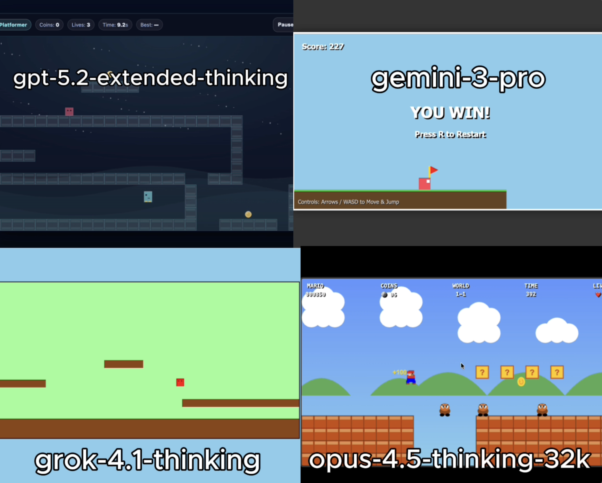

# 🧪 HTML AI Battle, HTML Animation Experiment

**TLDR:**  
4 Models try to: Make a Super Mario Game in HTML

---

## 🎯 Original Prompt

Make a side-scrolling platformer game like Super Mario Bros. using HTML/CSS/JS in a single HTML file.

---

## 📸 Results Preview

---

## 🤖 Per-Model Output Summary

| LLM Model                 |   LLM Reasoning Time (s) |   LLM Response Time (s) |   Reasoning Total words | Reasoning Total characters   |   Reasoning Total sentences | Reasoning top keyword   |   Reasoning top keyword repetitions |   Input Word Count |   Lines of HTML | Code in Reasoning?   |   prompt_adherence_score (0-10) |   functional_correctness_score (0-10) |   ui_score (0-10) |   Performance Score (0-10) |
|:--------------------------|-------------------------:|------------------------:|------------------------:|:-----------------------------|----------------------------:|:------------------------|------------------------------------:|-------------------:|----------------:|:---------------------|--------------------------------:|--------------------------------------:|------------------:|---------------------------:|
| gpt-5.2-extended-thinking |                       18 |                     233 |                     121 | 766                          |                           8 | Platformer              |                                   3 |                 16 |            1024 | n                    |                               8 |                                     3 |               9   |                        6.5 |
| gemini-3-pro              |                        5 |                      35 |                      41 | 258                          |                           2 | Html                    |                                   2 |                 16 |             319 | n                    |                               9 |                                     8 |               7   |                        8.2 |
| grok-4.1-thinking         |                        4 |                      11 |                      50 | 318                          |                           3 | Request                 |                                   2 |                 16 |             191 | n                    |                               7 |                                     8 |               6.5 |                        7.2 |
| opus-4.5-thinking-32k     |                       12 |                     188 |                     219 | 1,612                        |                           3 | Game                    |                                   8 |                 16 |            1134 | y                    |                              10 |                                     9 |              10   |                        9.7 |

## Weighted Performance Score
A single score that combines how well the model follows the prompt, how correctly the code works, and how good the UI looks.  
**performance_score = 0.40(prompt_adherence_score) + 0.35(functional_correctness_score) + 0.25(ui_score)**

---

## ✅ Experiment Rules
	•	✅ Same exact prompt for all models
	•	✅ First output only (no retries, no iterations)
	•	✅ Raw HTML outputs preserved exactly
	•	✅ No human edits

---

## 🧠 Observations
• gpt-5.2-extended-thinking: Produced an atypical amount of code and took longer than usual to generate, but distinguished itself as the only model to include sound effects for jumping. While the user interface was high-quality and visually polished, a critical structural flaw left the main character trapped, making the game unplayable and significantly impacting its utility.

• gemini-3-pro: Delivered a functional and playable experience that met the basic requirements of the prompt. The implementation was straightforward and reliable, though the visual design was overly simplistic, featuring a square-shaped character with minimal detail. It succeeded in core functionality but lacked aesthetic depth.

• grok-4.1-thinking: Followed a minimalist approach that prioritized playability over complexity. While it offered slightly more character detail than Gemini, the game suffered from a logic oversight where it lacked a definitive end state. Despite the infinite gameplay loop, it remained a functional entry that surpassed the unplayable state of the GPT model.

• opus-4.5-thinking-32k: Provided an exceptional, high-tier performance that far exceeded the other models in UI design, character detail, and overall polish. The execution was sophisticated and highly creative, marred only by a minor technical glitch where an enemy was found floating over a pit. It was the most advanced implementation by a significant margin.

---

🔗 Original Post

X (Twitter) post showcasing the experiment:

Link: 

---
